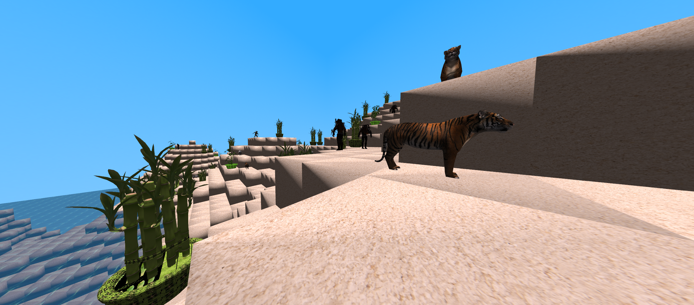
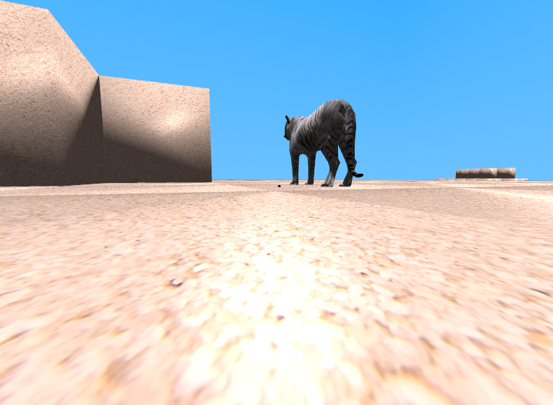
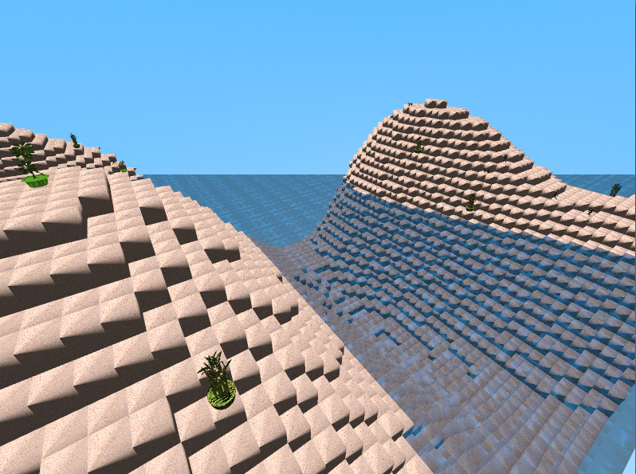
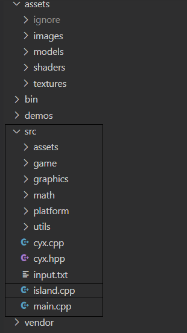

Small environment and "animation" rendered with OpenGl

# Showcase

# Compile

    ./build.sh

It's a bash script that will build for Linux by default.
But if your on `wsl` and has `mingw` installed, then it'll build a native windows static executable instead.
If you're on `Msys2` it'll dectect and also build native windows executable.

# Run
- ``bin/island`` [scene_input_file]
- If no ``scene_input_file`` is provided, a default one will be used

---

# Need:
## C++ 20 compiler
- Might work with c++17 compiler, but it was only tested with ``g++ 12.2.0``

---

# Commands:
- ``w, s, d, a``  forward, backward, sideways movement
- ``click`` and ``drag`` to control the view direction
- ``space, q`` to go up
-  ``e``       to go down
- ``wheel`` to change fov

---

# Recommended Settings
- You can feed environment settings to the executable through a argument path. The default settings are in ``src/input.txt``.
- If width or depth exceeds ``100`` might get pretty LOW fps. It's recommended to stay below this
range, and the height be less then ``50``

# Project Folder Structure

- ``src/`` contains all the source code, it containes ``main.cpp`` for a pseudo-bash script that includes the actual project ``island.cpp``, also can find the ``input.txt`` that provides a default scene description
- ``src/game`` all the island code that dependes on all the other folder in the ``src``
- ``src/utils`` utils function, doenst depend on any files 
- ``src/math`` generic mat and vec classes for matrices and vectors respectivaly, only depends on src/utils
- ``src/platform`` implementation of Window Interface using glut for now
- ``src/graphics`` all the core for graphics, loading meshes, loading texture and rendering using shaders
- ``src/assets`` contain static C arrays that contains data about the .obj directly into C, which means it'll be embedded into the executable
- ``vendor/`` All external libraries, glad, noise, utily for obj2c, stb image
- ``bin/`` binaries
- ``assets/`` resources for the project, including shaders, textures, models.
- ``docs/`` definition of the project from my class

